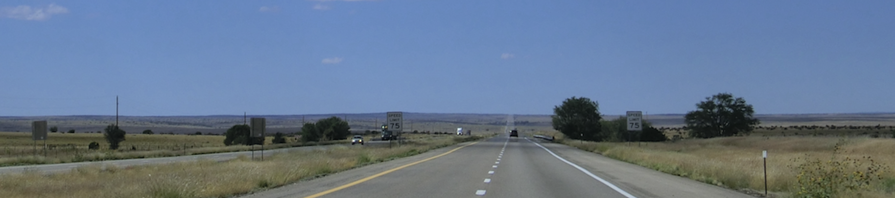

 
🚀  Never stop learning

---

 

## Side projects in recent months are shown in the table below. For further content or details, please click on the repository name to view.

| Num | Field / Type | Repository Name | Programming Language / Software / Tool |
| :---:          | :---           | :----         | :---            |
| 1 | Data Visualization, Automation, Web Development | [vue3_echarts_demo_01](<https://github.com/qinglian1105/vue3_echarts_demo_01>) | (1) Front-End: Vue3, ECharts, Bootstrap (2) Back-End: FastAPI, PostgreSQL (3) Other: Selenium, Beautiful Soup, Docker, n8n |
| 2 | Data Visualization, Automation, Web Development | [dash_plotly_demo_01](<https://github.com/qinglian1105/dash_plotly_demo_01>) | (1) Front-End: Plotly/Dash, Flask-Login (2) Back-End: FastAPI, PostgreSQL (3) Other: Selenium, Beautiful Soup, Docker, n8n |
| 3 |  Screen Parsing, Automation | [omniparser_pyautogui_demo](<https://github.com/qinglian1105/omniparser_pyautogui_demo>)  |  OmniParser V2, PyAutoGUI  |
| 4 | Large Language Model (LLM) | [rag_with_different_dbs](<https://github.com/qinglian1105/rag_with_different_dbs>)  |  Ollama, Qdrant, TimescaleDB, Python, Docker |
| 5 | Large Language Model (LLM) | [n8n_local_ollama_rag_chat](<https://github.com/qinglian1105/n8n_local_ollama_rag_chat>)  | n8n, Ollama, Qdrant, PostgreSQL, Python, Docker |
| 6 | Workflow Automation | [n8n_py_js_demo_01](<https://github.com/qinglian1105/n8n_py_js_demo_01>)  | n8n, Python, JavaScript, Docker |
| 7 | Web Scraping | [playwright_multitasking_demo_01](<https://github.com/qinglian1105/playwright_multitasking_demo_01>)  | Python, Playwright, threading, multiprocessing, asyncio, Docker |
| 8 | Machine Learning, Financial Risk Management | [credit_scorecards_demo_01](<https://github.com/qinglian1105/credit_scorecards_demo_01>)  | Python, PostgreSQL, Scikit-learn |
| 9 | CI/CD | [gitlab_cicd_demo_01](<https://github.com/qinglian1105/gitlab_cicd_demo_01>)  | GitLab CI/CD, Harbor(Docker Registry), Flask, Tensorflow(Keras) |
| 10 | Robotic Process Automation (RPA), Web Scraping | [tagui_demo_02](<https://github.com/qinglian1105/tagui_demo_02>)  | RPA for Python, APScheduler (Advanced Python Schedule), MongoDB |
| 11 | Robotic Process Automation (RPA) | [tagui_demo_01](<https://github.com/qinglian1105/tagui_demo_01>)  | TagUI, JavaScript, Python |
| 12 | Robotic Process Automation (RPA) | [uipath_demo_01](<https://github.com/qinglian1105/uipath_demo_01>) | UiPath Studio Desktop, UiPath Orchestrator Cloud, JavaScript, Python |
| 13 | Robotic Process Automation (RPA) | [power_automate_demo_01](<https://github.com/qinglian1105/power_automate_demo_01>)  | Power Automate Desktop, JavaScript, Python |
| 14 | Web Development, Machine Learning | [django_demo_01](<https://github.com/qinglian1105/django_demo_01>) | (1) Front-End: Django, JavaScript, Bootstrap, Chart.js, ECharts (2) Back-End: FastAPI, PostgreSQL, MongoDB  (3) Other: Docker, Scikit-learn, YOLOv5 |
| 15 | Web Development, Machine Learning | [c_sharp_demo_01](<https://github.com/qinglian1105/c_sharp_demo_01>) | (1) Front-End: ASP.NET Core MVC, Chart.js, Bootstrap  (2) Back-End: FastAPI, PostgreSQL  (3) Other: YOLOv5, Docker |
| 16 | Web Development | [java_demo_01](<https://github.com/qinglian1105/java_demo_01>) | (1) Front-End: Spring Boot, Chart.js, Bootstrap  (2) Back-End: PostgreSQL  (3) Other: Docker | 

 
 